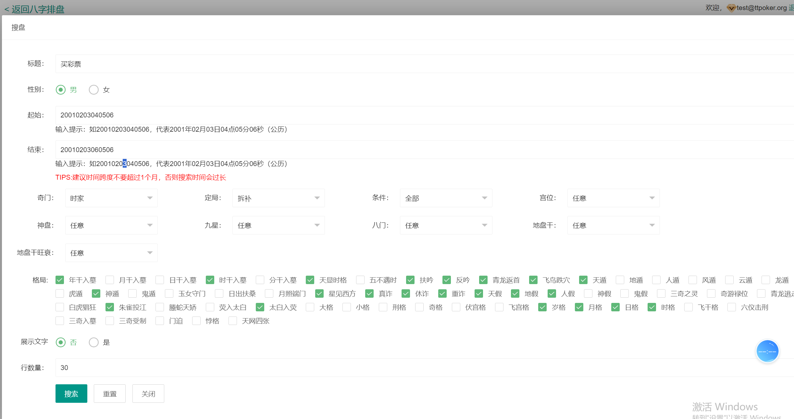
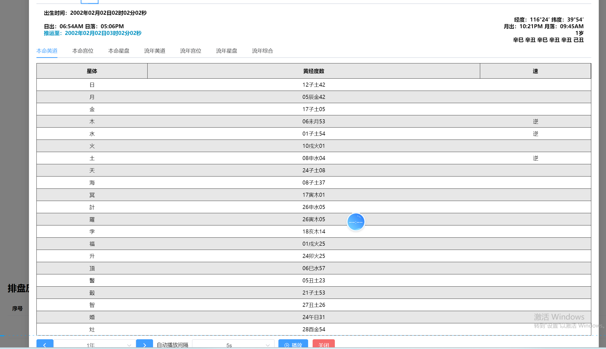
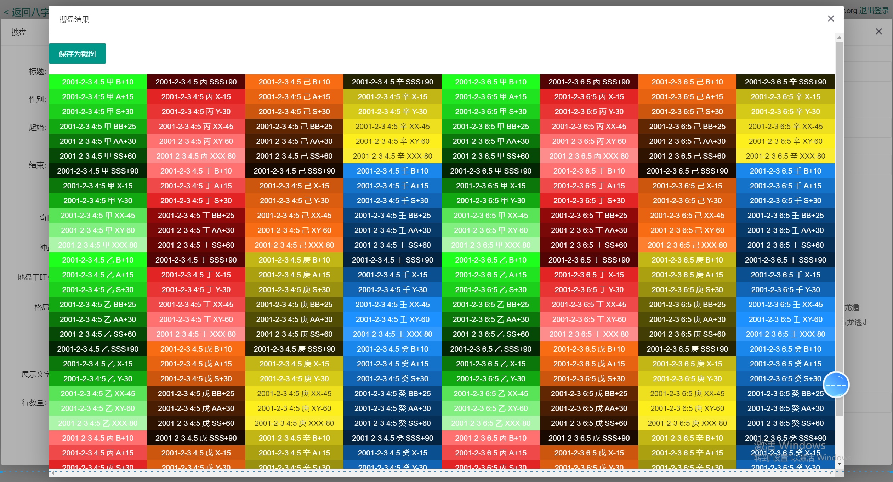
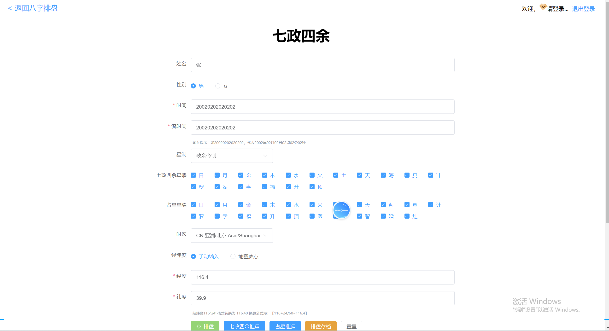
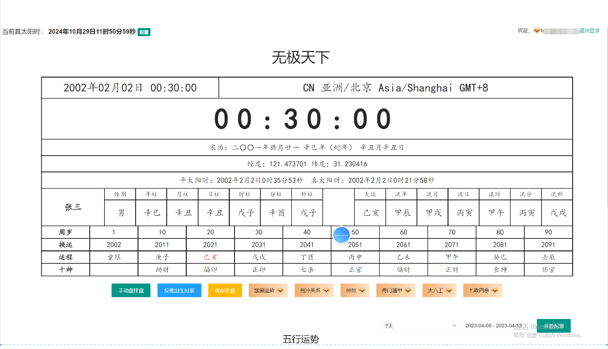

# Bazi Calculator — Chinese Astrology and Metaphysics Source Code

[简体中文](README.md) | [繁體中文](README.zh-TW.md) | [GitHub Pages](https://deepseek7878.github.io/bazi-calculator/)

Bazi Calculator is a Chinese metaphysics source-code project for Bazi / Four Pillars chart calculation, Zhouyi / I Ching divination, Qimen Dunjia, Zi Wei Dou Shu, Da Liu Ren and related destiny-analysis systems.

The project is positioned as a reusable foundation for traditional-culture applications, metaphysics SaaS products, online chart calculators, consulting platforms, mobile apps, mini programs and AI-assisted interpretation systems.

> Disclaimer: This project is intended for cultural research, entertainment, software development and reference use. It should not replace legal, medical, financial, psychological or other professional advice.

## SEO Keywords

- Bazi calculator source code
- Four Pillars astrology system
- Chinese astrology source code
- Chinese metaphysics platform
- Zhouyi I Ching divination
- Qimen Dunjia software
- Zi Wei Dou Shu source code
- Da Liu Ren chart calculation
- lunar calendar conversion
- destiny analysis system

## Feature Scope

- Bazi / Four Pillars chart generation: year, month, day and hour pillars
- Heavenly Stems and Earthly Branches calculation
- Ten Gods, hidden stems, yin-yang and five-element analysis
- Luck cycles, annual/monthly/daily trend references
- Zhouyi / I Ching hexagram generation and interpretation structure
- Qimen Dunjia chart layout with palaces, gates, stars and deities
- Zi Wei Dou Shu palace and star-chart structure
- Da Liu Ren chart and classical divination extensions
- Seven Luminaries and Four Extras style astrology extensions
- API, admin dashboard and multi-client product architecture

## Use Cases

- Bazi calculator websites
- Chinese astrology SaaS platforms
- AI metaphysics interpretation products
- WeChat mini programs and mobile apps
- Traditional-culture knowledge-payment products
- Consultant dashboard and customer report system
- Overseas Chinese astrology landing pages
- Research and learning tools for Chinese metaphysics

## Suggested Repository Structure

```text
frontend/              # Web or mobile client
backend/               # API services and business logic
admin/                 # Admin dashboard
database/              # Schema and migrations
config.example/        # Sanitized configuration examples
scripts/               # Build, deployment and initialization helpers
docs/                  # GitHub Pages product and technical documentation
tests/                 # Automated tests and chart validation cases
.github/workflows/     # CI and GitHub Pages workflows
```

## Technical Highlights

- Modular architecture for multiple Chinese metaphysics systems
- Suitable as the calculation core for SaaS, consulting and AI interpretation products
- Designed for multilingual SEO pages on GitHub, Google and Bing
- Can be extended into APIs, dashboards, mini programs and mobile clients
- Encourages verifiable chart-calculation logic before generating AI explanations

## 💰 联系我
📱 Telegram：@fox_lovemyself

📧 Email：lihongbo9414@gmail.com

## 🚀 Quick Demo / 快速演示 / 快速示範

**Input / 输入 / 輸入:**
Birth: 1990-05-15 14:00

**Output / 输出 / 輸出:**
八字: 庚午 辛巳 壬辰 丁未
四柱: 年柱庚午 月柱辛巳 日柱壬辰 时柱丁未
大运: 壬午 癸未 甲申 乙酉...
纳音: 路旁土 白蜡金 长流水 天河水














## Responsible Use

This repository is intended for software development, cultural research and entertainment-oriented applications. Public-facing products should clearly state that generated results are for reference only.
